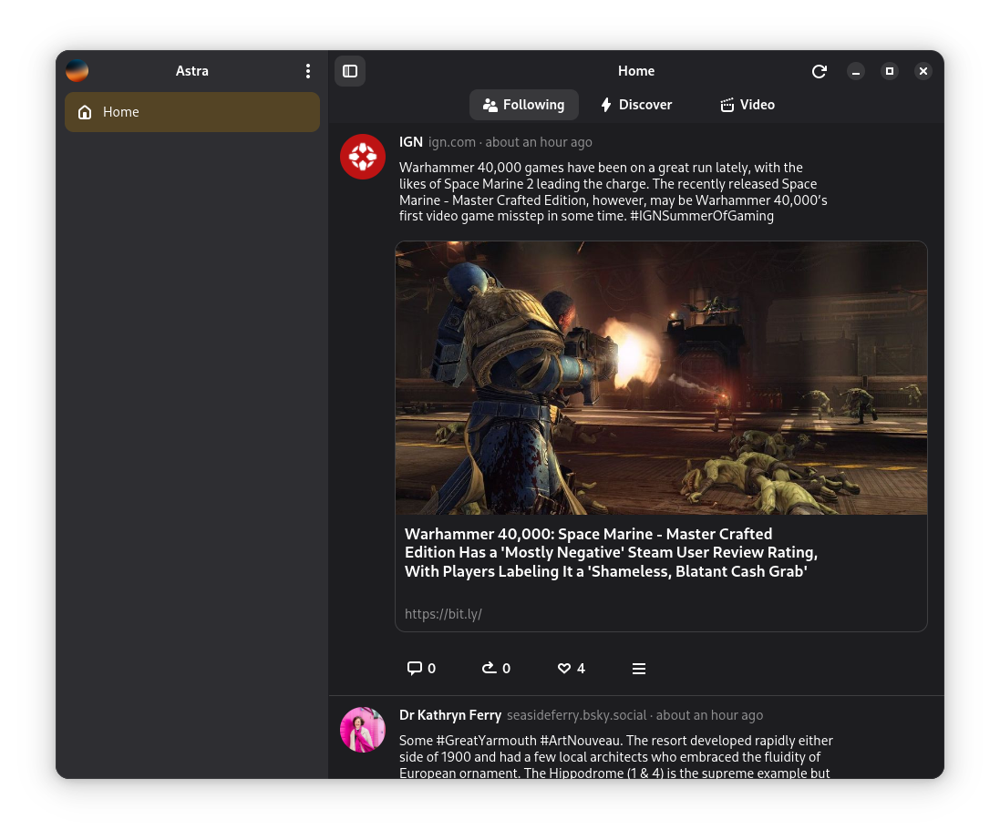

<p align="center">
  
</p>
<h1 align="center">Astra</h1>
<h3 align="center">A GTK 4 Bluesky client for Linux</h3>

<p align="center">
  
</p>

> [!WARNING]  
> This project is still early in development and is **not** ready for daily use.

## 🛣️ Roadmap

- Login
    - [X] Credential storage
- Timeline
    - [X] Avatar
    - [X] Text
    - [ ] Image
        - [X] One image
        - [X] Group of images
        - [ ] Full screen image viewer
    - [ ] Video
    - [X] Embedded Link
    - [ ] Likes Indicator
        - [ ] Submit like
    - [ ] Repost Indicator
        - [ ] Submit repost
    - [ ] Quote post
    - [X] View Replies
    - [ ] Change feeds
      - [X] Pinned feeds
      - [ ] Manage all feeds
    - [ ] Create a post
    - [ ] Searching
    - [ ] Notifications
    - [ ] Messages
    - [ ] Translations
- Other
  - [ ] Change provider

See open issues for further detail.

## 🚚 Building from source using Flatpak

To build and run the application as a Flatpak, ensure you have "flatpak-builder" installed on your system before executing the following comands from the root directory of this repository.

``` bash
wget -P ~/src https://raw.githubusercontent.com/flatpak/flatpak-builder-tools/master/dotnet/flatpak-dotnet-generator.py
python3 ~/src/flatpak-dotnet-generator.py --dotnet 8 --freedesktop 24.08 nuget-sources.json ~/src/Astra/Astra/Astra.Gtk/Astra.Gtk.csproj
flatpak-builder build-dir --user --install-deps-from=flathub --download-only io.github.lukearran.astra.yml
flatpak-builder build-dir --user --force-clean --install --repo=repo io.github.lukearran.astra.yml
flatpak run io.github.lukearran.astra.yml
```

## 🛠️ Building from source

#### 1. Prerequisites

- [.NET SDK 8.0](https://learn.microsoft.com/en-us/dotnet/core/install/linux-ubuntu-install?tabs=dotnet9&pivots=os-linux-ubuntu-2404)
- [Blueprint Compiler](https://gitlab.gnome.org/GNOME/blueprint-compiler)

#### 2. Clone the repository

```bash
git clone https://github.com/lukearran/Astra
```

This will create a local copy of the repository.

#### 3. Build the project

To build Astra for development, run the following command:

``` bash
dotnet run --project Astra/Astra.Gtk
```

## 🙋 Contributing

Want to contribute to this project? Let me know with an [issue](https://github.com/lukearran/Astra/issues) that communicates your intent to create a [pull request](https://github.com/lukearran/Astra/pulls).

## ⚖️ License

This project is licensed under the `MIT` license. See the `LICENSE.md` file for in the root directory for details.

## 😇 Acknowledgements

Astra uses the following libraries:

- [FishyFlip](https://github.com/drasticactions/FishyFlip)
- [Gir.Core](https://github.com/gircore/)
- [Blueprint](https://jwestman.pages.gitlab.gnome.org/blueprint-compiler/)
- [DBus.Services.Secrets](https://github.com/Ace4896/DBus.Services.Secrets)